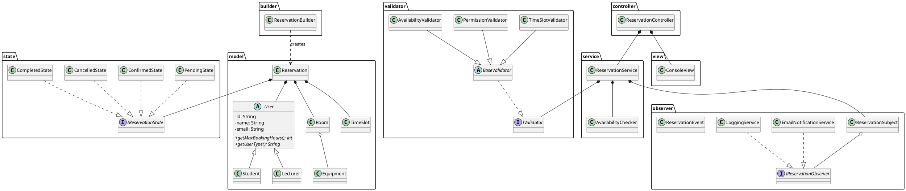

# UML Class Diagram - System Rezerwacji Sal

## Instrukcja tworzenia diagramu

Poniższy opis zawiera wszystkie klasy i relacje do narysowania w narzędziu UML (np. draw.io, Visual Paradigm, PlantUML).

---

## PAKIET: model

### User (abstract)
**Atrybuty:**
- -id: String
- -name: String
- -email: String

**Metody:**
+ User(id: String, name: String, email: String)
+ getId(): String
+ getName(): String
+ getEmail(): String
+ getMaxBookingHours(): int {abstract}
+ getUserType(): String {abstract}
+ toString(): String

### Student
**Dziedziczy:** User

**Metody:**
+ Student(id: String, name: String, email: String)
+ getMaxBookingHours(): int
+ getUserType(): String

### Lecturer
**Dziedziczy:** User

**Metody:**
+ Lecturer(id: String, name: String, email: String)
+ getMaxBookingHours(): int
+ getUserType(): String

### Room
**Atrybuty:**
- -id: String
- -name: String
- -capacity: int
- -equipment: List<Equipment>

**Metody:**
+ Room(id: String, name: String, capacity: int)
+ addEquipment(eq: Equipment): void
+ getId(): String
+ getName(): String
+ getCapacity(): int
+ getEquipment(): List<Equipment>
+ toString(): String

### Equipment
**Atrybuty:**
- -name: String
- -quantity: int

**Metody:**
+ Equipment(name: String, quantity: int)
+ getName(): String
+ getQuantity(): int
+ toString(): String

### TimeSlot
**Atrybuty:**
- -startTime: LocalDateTime
- -endTime: LocalDateTime

**Metody:**
+ TimeSlot(startTime: LocalDateTime, endTime: LocalDateTime)
+ getStartTime(): LocalDateTime
+ getEndTime(): LocalDateTime
+ getDurationInHours(): long
+ overlapsWith(other: TimeSlot): boolean
+ toString(): String

### Reservation
**Atrybuty:**
- -id: String
- -user: User
- -room: Room
- -timeSlot: TimeSlot
- -purpose: String
- -state: IReservationState

**Metody:**
+ Reservation(...)
+ getId(): String
+ getUser(): User
+ getRoom(): Room
+ getTimeSlot(): TimeSlot
+ getPurpose(): String
+ getState(): IReservationState
+ setState(state: IReservationState): void
+ confirm(): void
+ cancel(): void
+ complete(): void
+ toString(): String

---

## PAKIET: state (State Pattern)

### IReservationState <<interface>>
**Metody:**
+ confirm(reservation: Reservation): void
+ cancel(reservation: Reservation): void
+ complete(reservation: Reservation): void
+ getStateName(): String

### PendingState
**Implementuje:** IReservationState

**Metody:**
+ confirm(reservation: Reservation): void
+ cancel(reservation: Reservation): void
+ complete(reservation: Reservation): void
+ getStateName(): String

### ConfirmedState
**Implementuje:** IReservationState

**Metody:**
+ confirm(reservation: Reservation): void
+ cancel(reservation: Reservation): void
+ complete(reservation: Reservation): void
+ getStateName(): String

### CancelledState
**Implementuje:** IReservationState

**Metody:**
+ confirm(reservation: Reservation): void
+ cancel(reservation: Reservation): void
+ complete(reservation: Reservation): void
+ getStateName(): String

### CompletedState
**Implementuje:** IReservationState

**Metody:**
+ confirm(reservation: Reservation): void
+ cancel(reservation: Reservation): void
+ complete(reservation: Reservation): void
+ getStateName(): String

---

## PAKIET: observer (Observer Pattern)

### ReservationEvent
**Atrybuty:**
- -reservation: Reservation
- -eventType: EventType (enum)
- -timestamp: long

**Metody:**
+ ReservationEvent(reservation: Reservation, eventType: EventType)
+ getReservation(): Reservation
+ getEventType(): EventType
+ getTimestamp(): long
+ toString(): String

### IReservationObserver <<interface>>
**Metody:**
+ onReservationEvent(event: ReservationEvent): void

### ReservationSubject
**Atrybuty:**
- -observers: List<IReservationObserver>

**Metody:**
+ addObserver(observer: IReservationObserver): void
+ removeObserver(observer: IReservationObserver): void
+ notifyObservers(event: ReservationEvent): void

### EmailNotificationService
**Implementuje:** IReservationObserver

**Metody:**
+ onReservationEvent(event: ReservationEvent): void

### LoggingService
**Implementuje:** IReservationObserver

**Metody:**
+ onReservationEvent(event: ReservationEvent): void

---

## PAKIET: validator (Chain of Responsibility)

### IValidator <<interface>>
**Metody:**
+ setNext(validator: IValidator): void
+ validate(reservation: Reservation): void

### BaseValidator (abstract)
**Implementuje:** IValidator
**Atrybuty:**
# -next: IValidator

**Metody:**
+ setNext(validator: IValidator): void
+ validate(reservation: Reservation): void
# doValidate(reservation: Reservation): void {abstract}

### TimeSlotValidator
**Dziedziczy:** BaseValidator

**Metody:**
# doValidate(reservation: Reservation): void

### PermissionValidator
**Dziedziczy:** BaseValidator

**Metody:**
# doValidate(reservation: Reservation): void

### AvailabilityValidator
**Dziedziczy:** BaseValidator
**Atrybuty:**
- -availabilityChecker: AvailabilityChecker

**Metody:**
+ AvailabilityValidator(checker: AvailabilityChecker)
# doValidate(reservation: Reservation): void

### ValidationException
**Dziedziczy:** Exception

**Metody:**
+ ValidationException(message: String)

---

## PAKIET: builder (Builder Pattern)

### ReservationBuilder
**Atrybuty:**
- -id: String
- -user: User
- -room: Room
- -startTime: LocalDateTime
- -endTime: LocalDateTime
- -purpose: String

**Metody:**
+ ReservationBuilder()
+ forUser(user: User): ReservationBuilder
+ inRoom(room: Room): ReservationBuilder
+ startingAt(startTime: LocalDateTime): ReservationBuilder
+ endingAt(endTime: LocalDateTime): ReservationBuilder
+ withDuration(hours: int): ReservationBuilder
+ withPurpose(purpose: String): ReservationBuilder
+ build(): Reservation
+ reset(): ReservationBuilder

---

## PAKIET: service

### AvailabilityChecker
**Atrybuty:**
- -allReservations: List<Reservation>

**Metody:**
+ AvailabilityChecker()
+ registerReservation(reservation: Reservation): void
+ isRoomAvailable(room: Room, timeSlot: TimeSlot): boolean
+ getReservationsForRoom(room: Room): List<Reservation>
+ getReservationsForUser(user: User): List<Reservation>
+ getAllReservations(): List<Reservation>

### ReservationService
**Atrybuty:**
- -availabilityChecker: AvailabilityChecker
- -validatorChain: IValidator
- -eventPublisher: ReservationSubject

**Metody:**
+ ReservationService(checker: AvailabilityChecker, publisher: ReservationSubject)
+ createReservation(reservation: Reservation): Reservation
+ confirmReservation(reservation: Reservation): void
+ cancelReservation(reservation: Reservation): void
+ completeReservation(reservation: Reservation): void
+ getAvailabilityChecker(): AvailabilityChecker

---

## PAKIET: view (MVC - View)

### ConsoleView
**Atrybuty:**
- -scanner: Scanner

**Metody:**
+ ConsoleView()
+ displayMainMenu(): void
+ getUserChoice(): int
+ displayRooms(rooms: List<Room>): void
+ displayReservations(reservations: List<Reservation>): void
+ selectRoom(maxIndex: int): int
+ getStartTime(): LocalDateTime
+ getDuration(): int
+ getPurpose(): String
+ getReservationId(): String
+ displaySuccess(message: String): void
+ displayError(message: String): void
+ displayMessage(message: String): void
+ waitForEnter(): void
+ close(): void

---

## PAKIET: controller (MVC - Controller)

### ReservationController
**Atrybuty:**
- -view: ConsoleView
- -reservationService: ReservationService
- -currentUser: User
- -availableRooms: List<Room>

**Metody:**
+ ReservationController(...)
+ run(): void
- handleShowRooms(): void
- handleCreateReservation(): void
- handleShowMyReservations(): void
- handleConfirmReservation(): void
- handleCancelReservation(): void
- handleCompleteReservation(): void
- findReservationById(): Reservation

---

## RELACJE

### Dziedziczenie:
- Student ──|> User
- Lecturer ──|> User
- PendingState ──|> IReservationState
- ConfirmedState ──|> IReservationState
- CancelledState ──|> IReservationState
- CompletedState ──|> IReservationState
- BaseValidator ──|> IValidator
- TimeSlotValidator ──|> BaseValidator
- PermissionValidator ──|> BaseValidator
- AvailabilityValidator ──|> BaseValidator
- EmailNotificationService ──|> IReservationObserver
- LoggingService ──|> IReservationObserver

### Kompozycja/Agregacja:
- Reservation ◆── User
- Reservation ◆── Room
- Reservation ◆── TimeSlot
- Reservation ◆── IReservationState
- Room ◆── Equipment (1..*)
- ReservationSubject ◆── IReservationObserver (0..*)
- ReservationService ◆── AvailabilityChecker
- ReservationService ◆── ReservationSubject
- ReservationService ◆── IValidator
- ReservationController ◆── ConsoleView
- ReservationController ◆── ReservationService
- ReservationController ◆── User
- ReservationController ◆── Room (0..*)
- AvailabilityValidator ◆── AvailabilityChecker

### Dependency:
- ReservationBuilder ..> Reservation (creates)
- ReservationService ..> ReservationEvent (creates)
- Main ..> wszystkie komponenty (uses)

---

## Sugestie dotyczące layoutu

**Warstwa Model:** Lewa górna część diagramu
**Warstwa State:** Prawa górna część
**Warstwa Observer:** Środek po prawej
**Warstwa Validator:** Dolna lewa część
**Warstwa Builder:** Środek dolny
**Warstwa Service:** Środek
**Warstwa MVC:** Dolna prawa część

**Łączna liczba klas:** 29 klas + 3 interfejsy = 32 elementy

---

## Narzędzia do rysowania

1. **draw.io** (zalecane - darmowe, łatwe): https://app.diagrams.net/
2. **PlantUML** (kod tekstowy): można wygenerować automatycznie
3. **Visual Paradigm Community Edition**
4. **Lucidchart**

---

## PlantUML Code (opcjonalnie - do automatycznego wygenerowania)

Możesz użyć poniższego kodu w PlantUML do automatycznego wygenerowania diagramu:

Skopiuj powyższy kod do: https://www.plantuml.com/plantuml/uml/
